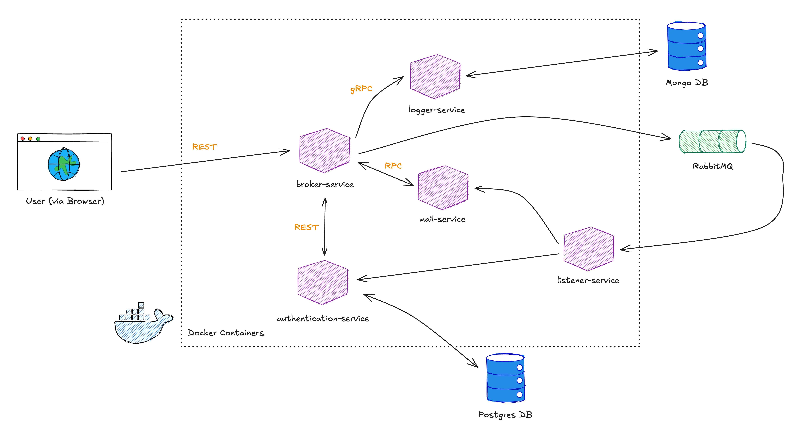
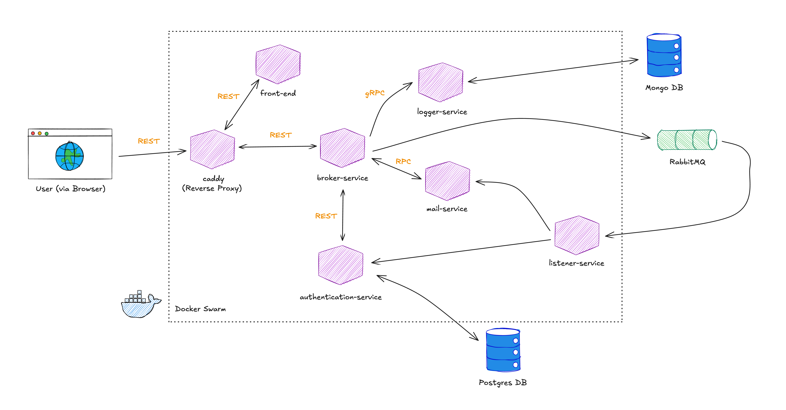
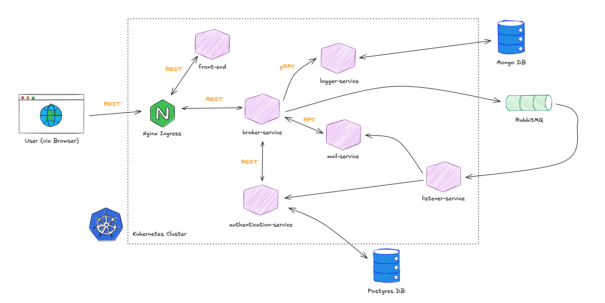

[](https://golang.org)

# Microservices in Go

This project
consists of a number of loosely coupled microservices:

- broker-service: an optional single entry point to connect to all services from one place (accepts JSON;
sends JSON, makes calls via gRPC, and pushes to RabbitMQ)
- authentication-service: authenticates users against a Postgres database (accepts JSON)
- logger-service: logs important events to a MongoDB database (accepts RPC, gRPC, and JSON)
- queue-listener-service: consumes messages from amqp (RabbitMQ) and initiates actions based on payload (sends via RPC)
- mail-service: sends email (accepts JSON)

In addition to the microservices, the included `docker-compose.yml` at the root level of the project
starts the following services:

- Postgresql - used by the authentication service to store user accounts
- MongoDB - used by the logger service to save logs from all services
- mailhog - used as a fake mail server to work with the mail service

## Running the project

The project was developed with three levels of achitectural complexity. 

### Docker containers running locally

#### Architecture 



#### How to run 

Build all images and deploy the backend as docker containers with `docker-compose up`
```bash
make build_and_docker_compose 
```

Build and start the front end: 
```bash
make start
```

Hit the front end with your web browser at `http://localhost:80`

To stop everything:

```bash
make stop
make down
```

### Docker Swarm with Reverse Proxy

#### Architecture



#### How to run 

Start docker swarm with the current machine as the manager
```bash
docker swarm init
```

- Build and push docker images to local image repository
- deploy the stack `myapp` with configuration `swarm.yml`, deploying each app as a docker service
```bash
make build_and_start_swarm
```

Hit the front end with your web browser at `http://localhost:80`

- Stop the services running in the swarm by removing the stack `myapp`
```bash
make stop_swarm
```

Tear down one node swarm
```bash
docker swarm leave
```


### K8s with Nginx Ingress

#### Architecture



#### How to run 

Start postgres service independently: 
```bash
docker-compose -f postgres.yml up -d
```

Deploy our apps and other 3rd party services as k8s pods: 
```bash
kubectl apply -f k8s
```

Deploy the Nginx ingress controller
```bash
kubectl apply -f k8s/ingress/deploy-nginx-controller.yml
```

Wait a few seconds for that to become available, then apply the ingress: 
```bash
kubectl apply -f k8s/ingress/ingress.yml
```

Hit the front end with your web browser at `http://localhost:30080/frontend`

To stop everything: 
```bash 
docker-compose down
kubectl delete -f k8s
kubectl delete -f k8s/ingress
```